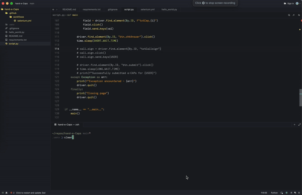

# hand-e-Caps

Python script using Selenium to fill in e-CAPS weekly form. It uses selenium web driver for Chrome. By default its set to run in headless mode.

Verify form submission by checking that the output "Successfully submitted e-CAPs for USER" is printed.

## Demo

## Setup and runing locally

0. Install Chrome web browser
1. Install python3
2. Create virtual env with python - `python -m venv .venv`
3. Source virtual env with `source .venv/bin/activate`
4. pip install -r requirements.txt
5. python script.py

## Future work
- [x] Set USER args to make form submission applicable to anyone
